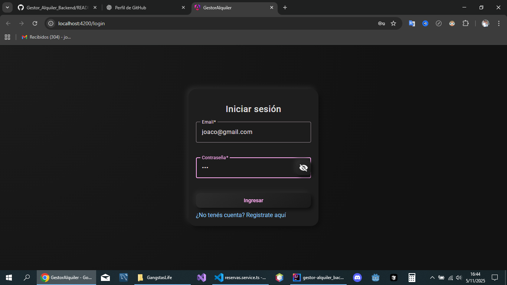
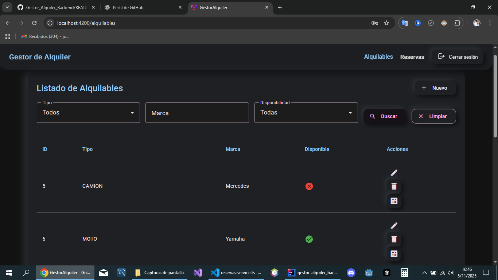
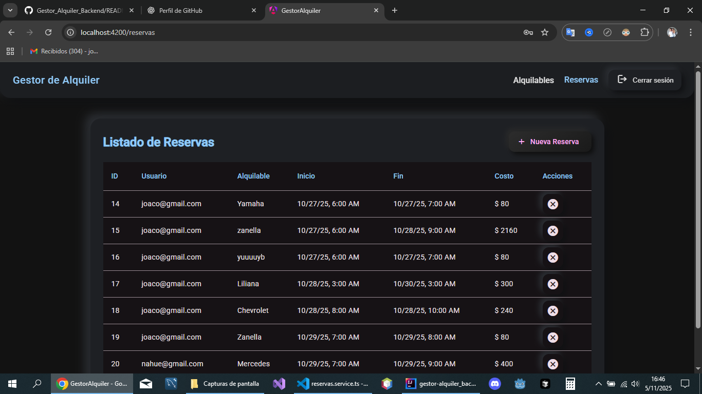
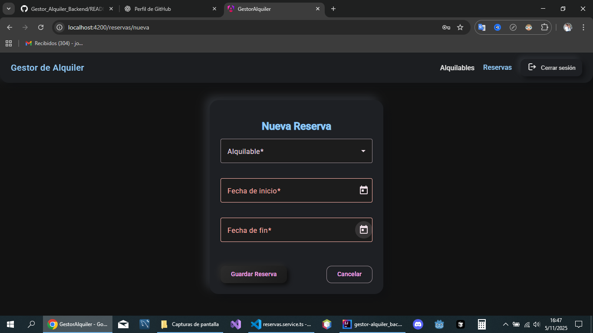

<p align="center">
  
</p>

<p align="center">
  <b>Angular 19 • Dark Neumorphism UI • JWT Auth • Material Design</b><br>
  <i>Frontend for the rental management system</i>
</p>

---

# 🚀 Overview

**Gestor_Alquiler_Frontend** is a modern **Angular 19** application with a **neumorphic dark interface**, designed to manage:

- ✅ Vehicle rentals (charged per hour)  
- ✅ Appliance rentals (charged per day)  
- ✅ User-specific reservations (linked to email login)  

The frontend consumes the **Spring Boot REST API** and includes a complete authentication flow with **JWT**, route protection, filtering, forms, and Angular Material components.

---

# 🎨 UI Style

- 🟣 **Dark mode + neumorphism**  
- 💜 Purple highlight (matching brand identity)  
- ⭐ Soft shadows and rounded surfaces  
- ✔️ Forms with Material Design + Reactive Forms  
- ✔️ DatePickers for selecting rental dates  
- ✔️ Snackbar notifications for feedback  

---

# ✅ Features

### 🔐 **Auth**
- Login & Registration  
- JWT saved in `sessionStorage`  
- AuthGuard for protected routes  
- Interceptor attaches token to every request  

### 📦 **Rental / Alquilables**
- List + Filters (type, brand, availability)  
- Create / Edit alquilables  
- Availability indicators (✅ / ❌)  
- CRUD UI with neumorphic modals  
- Linked to backend pricing strategies  

### 📄 **Reservations**
- List of all rentals  
- Rentals tied to the logged user  
- Create new reservation form  
- Datepicker for start & end dates  
- Cost returned from backend automatically  

### 🧭 Navigation
- Login  
- Register  
- Alquilables  
- Reservas  
- Logout  

---

# 🖼️ Screenshots

> Make sure these files exist inside `/assets/screens/`.

### ✅ Login  
<p align="center">
  
</p>

### ✅ Alquilables List  
<p align="center">
  
</p>

### ✅ Reservations List  
<p align="center">
  
</p>

### ✅ New Reservation  
<p align="center">
  
</p>

---

# 🧠 Architecture
src/  
├── app/  
│ ├── components/  
│ ├── pages/  
│ ├── services/  
│ ├── guards/  
│ ├── interceptors/  
│ └── models/  
├── assets/  
└── environments/  

### 🔧 Main Parts

- **Services** – communication with backend  
- **Guards** – protect routes via JWT  
- **Interceptors** – inject Authorization header  
- **Reactive Forms** – login, register, CRUDs  
- **Material UI** – cards, buttons, select, datepicker  

---

# 🌐 API Integration

The base URL is configured in:
src/environments/environment.ts  

Example:

```ts
export const environment = {
  apiUrl: 'http://localhost:8080'
};
```
All services derive from this endpoint.  

# ▶️ How to Run  

### ✅ 1. Clone the repo  
git clone https://github.com/joacko23/Gestor_Alquiler_Frontend.git
cd Gestor_Alquiler_Frontend

### ✅ 2. Install dependencies  
npm install  

### ✅ 3. Run the project  
ng serve -o  

Frontend available at:
➡️ http://localhost:4200  

# 🛠️ Technologies

- Angular 19

- Angular Material

- Reactive Forms

- RxJS

- TypeScript

- JWT Interceptor

- Neumorphism UI

- HTML / SCSS

# 📌 Status

### 🚧 In development  

# 👨‍💻 Author

**Joaquín Domenech**  
Full-Stack Developer  
📧 joackodomenech@gmail.com

<p align="center">  </p>

